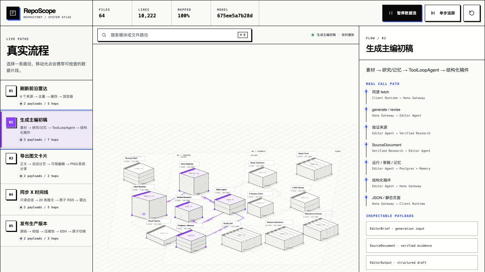

# map-codebase

`map-codebase` 是一个用于生成交互式代码库架构地图的 Codex Skill。

它会读取真实源码，将代码子系统转换为可缩放、可拖拽、可检查的等距数字建筑，并把有源码证据的调用关系绘制为地面线路。沿线路移动的光点代表真实的数据片段，可以暂停、单步追踪并查看其内容。



## 主要能力

- 从项目入口、路由、服务端、后台任务、数据层、测试与部署脚本中识别代码子系统。
- 根据真实文件测量结果生成模块体量，而不是手工填写统计数字。
- 为每条模块连接记录源码证据路径。
- 从源码中整理用户流程、后台流程和发布流程。
- 为流程生成可点击检查的 payload 数据片段。
- 支持模块和文件搜索、缩放、拖拽、暂停、继续、单步追踪与视图重置。
- 支持复制模块或流程的讨论上下文，方便继续与 Codex 或其他 AI 讨论代码。
- 生成稳定指纹，并通过 `--check` 检测代码与架构地图是否发生漂移。
- 支持键盘操作、移动端布局和 `prefers-reduced-motion`。

## 视觉编码

Atlas 使用等距建筑模型表达代码结构。

| 代码特征 | 视觉表达 |
|---|---|
| 单文件且代码密度高 | 高塔式单体模块 |
| 多文件共同组成一个职责 | 多层堆叠模块 |
| 大量并列文件 | 切片阵列 |
| 横向渲染或转换管线 | 宽而低的板块 |
| 代码行数 | 模块占地与高度 |
| 文件数量与平均文件密度 | 模块形态、分层和切片数量 |
| 调用、写入、响应或发布关系 | 等距地面线路 |
| 流程中的请求、记录或产物 | 沿线路移动的可检查光点 |

ASCII 点、`0`、`1`、`+` 和 `:` 只作为代码块表面的确定性纹理。背景不生成装饰性粒子云、神经网络或与代码无关的动态效果。

## 工作原则

### 人工解释语义，脚本测量规模

模块职责、实现说明、流程与 payload 需要根据源码理解后编写；文件数、代码行数、字节数、覆盖率和内容指纹由同步脚本生成。

### 只绘制有证据的连接

每条 edge 必须至少包含一个真实存在的源码路径。请求与响应携带不同数据时，应分别建模为两个方向的连接。

### 一个文件只属于一个模块

同步脚本会检查文件归属重叠和未归属文件。模块之间的协作通过 edge 表达，而不是让同一个文件重复属于多个节点。

### 动画必须携带信息

移动光点必须代表真实的数据形状，例如 HTTP 请求、数据库记录、Feed、生成结果或发布产物。装饰性动画不属于 Atlas。

## 目录结构

```text
map-codebase/
├── SKILL.md
├── README.md
├── agents/
│   └── openai.yaml
├── assets/
│   ├── atlas.config.example.json
│   └── atlas-template/
│       ├── index.html
│       ├── atlas.css
│       └── atlas.js
├── references/
│   ├── authoring.md
│   └── schema.md
└── scripts/
    └── sync-atlas.mjs
```

## 安装

克隆仓库并复制到 Codex Skills 目录：

```bash
git clone https://github.com/MegD1/map-codebase.git
mkdir -p ~/.codex/skills
cp -R ./map-codebase ~/.codex/skills/map-codebase
```

开发 Skill 时可以使用符号链接，避免每次修改后重新复制：

```bash
mkdir -p ~/.codex/skills
ln -s "$(pwd)/map-codebase" ~/.codex/skills/map-codebase
```

重新打开 Codex 任务后，即可使用 `$map-codebase`。

## 使用方式

在需要分析的代码库中告诉 Codex：

```text
使用 $map-codebase 为这个仓库生成一份可交互式代码架构图。
```

也可以指定关注范围：

```text
使用 $map-codebase 梳理这个仓库。
重点展示核心写入流程、后台任务、数据层和生产发布链路。
```

更新已有 Atlas：

```text
使用 $map-codebase 更新现有架构地图。
保留节点位置和流程顺序，只处理发生变化的模块与调用关系。
```

## 生成到目标仓库的文件

默认会在目标仓库中创建：

```text
atlas/
├── index.html
├── atlas.css
├── atlas.js
├── atlas.config.json
├── data.generated.js
└── measurements.generated.json

scripts/
└── sync-atlas.mjs
```

其中：

- `atlas.config.json`：人工维护的系统模型，包括分组、节点、连接、流程和 payload。
- `measurements.generated.json`：脚本生成的完整测量结果。
- `data.generated.js`：供浏览器直接加载的同一份生成数据。
- `sync-atlas.mjs`：扫描、测量、归属校验与漂移检测脚本。

## 推荐的项目命令

在目标仓库的 `package.json` 中加入：

```json
{
  "scripts": {
    "atlas:sync": "node scripts/sync-atlas.mjs --root .",
    "atlas:check": "node scripts/sync-atlas.mjs --root . --check"
  }
}
```

生成或更新测量数据：

```bash
npm run atlas:sync
```

检查 Atlas 是否与当前代码一致：

```bash
npm run atlas:check
```

`atlas:check` 会在以下情况返回失败：

- 受控源码中存在未归属文件；
- 一个文件同时属于多个模块；
- edge 的证据路径不存在；
- 生成文件与当前源码指纹不一致。

## 配置模型

`atlas/atlas.config.json` 包含以下顶层字段：

| 字段 | 用途 |
|---|---|
| `meta` | 产品名、仓库名、标题、说明和版本 |
| `sources` | 需要纳入测量的源码 glob |
| `ignore` | 需要排除的依赖、构建产物、运行数据和敏感目录 |
| `groups` | 系统区域及其空间位置 |
| `nodes` | 子系统职责、源码归属模式和位置 |
| `edges` | 有源码证据的定向调用关系 |
| `flows` | 按顺序组织的调用路径及可检查 payload |

详细字段说明见 [`references/schema.md`](./references/schema.md)，建模规则见 [`references/authoring.md`](./references/authoring.md)。

## 安全边界

同步脚本只输出文件路径和测量数据，不会把源码正文写入生成文件。

配置时应明确排除：

- `.env` 和其他凭据文件；
- Cookie、浏览器会话与认证缓存；
- 数据库文件和运行时数据；
- 用户上传内容；
- 构建产物与依赖目录；
- 完整内部 Prompt 或生产数据样本。

Payload 示例应使用占位值，不应复制真实凭据、个人内容或生产记录。

## 验证

Skill 可以使用官方校验脚本检查目录结构和元数据：

```bash
python3 /path/to/skill-creator/scripts/quick_validate.py .
```

仓库自身不依赖第三方包，可以直接运行基础校验：

```bash
npm run check
```

发布或交付 Atlas 前，建议同时完成：

1. 运行目标仓库的语法、类型、Lint 与测试命令。
2. 运行 `atlas:check`。
3. 检查所有流程、模块、payload 和搜索结果。
4. 验证暂停、单步、缩放、拖拽和键盘操作。
5. 检查桌面、平板、手机及 reduced-motion 模式。
6. 确认生成文件中不存在敏感内容。

## 适用场景

- 新成员熟悉陌生代码库；
- 与 Codex 讨论具体模块和调用路径；
- 重构前梳理系统边界；
- 追踪一次请求或后台任务的数据流；
- 技术分享与架构评审；
- 检查代码增长后架构文档是否过期。

`map-codebase` 的目标不是替代源码，而是为源码建立一份可以共同观察、定位和讨论的空间模型。
